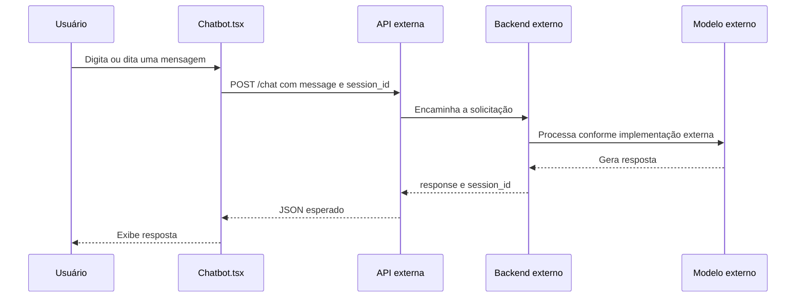

# Chatbot

## Fluxo observado



O trecho entre API, backend e modelo é uma arquitetura esperada/documentada. Apenas o componente frontend e o envio HTTP estão versionados neste repositório.

## Payload enviado

`Chatbot.tsx` envia:

```json
{
  "message": "string",
  "session_id": "string | null"
}
```

A requisição é `POST`, usa `Content-Type: application/json` e tem como base `import.meta.env.VITE_API_URL`.

## Resposta esperada

```json
{
  "response": "string",
  "session_id": "string"
}
```

O frontend verifica `response.ok`, lê o JSON, atualiza o `session_id` se ele existir e adiciona `data.response` à conversa.

## Sessão e estado local

- A primeira mensagem envia `session_id: null`.
- O ID retornado é guardado em `useState`.
- Mensagens seguintes da mesma montagem do componente reutilizam o ID.
- O histórico visível fica em um array local de mensagens.
- Recarregar a página perde o estado local e o `session_id`.

A documentação existente descreve persistência externa do histórico, mas o banco e o backend responsáveis por isso não estão no repositório.

## Fallback

Sem `VITE_API_URL`, o frontend usa:

```text
http://localhost:8000/api
```

O fallback é apenas uma URL padrão. Ele não cria nem inicia um backend.

## Entrada por voz

O componente tenta usar `SpeechRecognition` ou `webkitSpeechRecognition` do navegador. O idioma é `pt-BR`, o resultado é convertido em texto e colocado no campo antes do envio. O áudio não é enviado pelo frontend ao endpoint.

## Contexto conhecido

O site conhece os projetos, serviços, perguntas e dados de perfil através de `src/data/mock.ts`. Esse conteúdo é usado diretamente pelos componentes visuais.

## O que não está conectado automaticamente

- `Chatbot.tsx` não importa `mock.ts`.
- Nenhum projeto, FAQ ou perfil é anexado ao payload.
- Não há prompt de sistema no frontend.
- Não há implementação de RAG.
- Não há identificação do modelo efetivo no código da landing page.
- Não há confirmação de que o backend externo use os mesmos dados apresentados no site.

## Limitações atuais

- Backend não versionado.
- Sem validação de schema da resposta.
- Sem timeout ou cancelamento explícito.
- Sem autenticação visível no frontend.
- Sem persistência local da sessão.
- Mensagem de erro é genérica.
- Dependência de disponibilidade e CORS da API externa.
